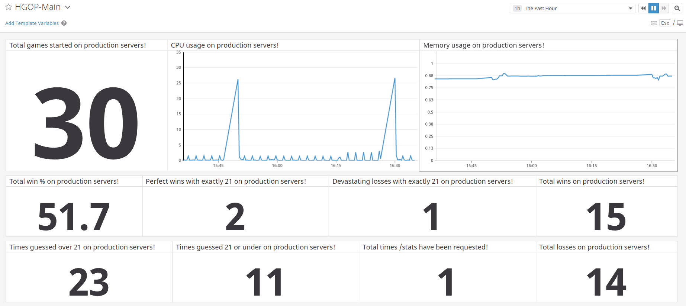

### T-542-HGOP 

**Instructors:** Guðlaugur Stefán Egilsson and Hannes Pétursson

**Teaching assistants:** Fanney Sigurðardóttir, Hrafn Orri Hrafnkelsson and Kristinn Þorri Þrastarson

---

This README contains information on Assignments 1 and 2 which were finished in the first 2 weeks in the course Introduction to quality management and testing. 

<br>

<details>
<summary><b>Week 1</b></summary>

#### API instance 
Here is a link to our API instace:
http://54.86.210.109:3000/status

#### Project status (Week 1)

```bash
├── assignments
│   ├── day01
│   │   └── answers.md
│   └── day02
│       └── answers.md
├── item_repository
│   ├── app.js
│   ├── database.js
│   ├── Dockerfile
│   └── package.json
├── scripts
│   ├── deploy.sh
│   ├── initialize_game_api_instance.sh
│   └── setup_local_dev_environment.sh
├── .gitignore
├── README.md
├── aboutus.md
├── docker-compose.yml
└── infrastructure.tf

```
</details>
<details>
<summary><b>Week 2</b></summary>

#### Project status (Week 2)

```bash
├── assignments
│   ├── day01
│   │   └── answers.md
│   └── day02
│       └── answers.md
├── game_api
│   ├── .dockerignore
│   ├── .eslintrc.json
│   ├── app.js
│   ├── config.js
│   ├── context.js
│   ├── database.js
│   ├── dealer.js
│   ├── dealer.unit-test.js
│   ├── deck.js
│   ├── deck.unit-test.js
│   ├── Dockerfile
│   ├── inject.js
│   ├── lucky21.js
│   ├── lucky21.unit-test.js
│   ├── package.json
│   ├── random.js
│   ├── random.unit-test.js
│   └── server.js
├── scripts
│   ├── deploy.sh
│   ├── docker_build.sh
│   ├── docker_compose_up.sh
│   ├── docker_push.sh
│   ├── initialize_game_api_instance.sh
│   ├── jenkins_deploy.sh
│   ├── setup_local_dev_environment.sh
│   └── sync_session.sh
├── .gitignore
├── Jenkinsfile
├── README.md
├── aboutus.md
├── docker-compose.yml
└── infrastructure.tf

```
</details>

<details open>
<summary><b>Week 3</b></summary>

### Jenkins instance 
Here is a link to our Jenkins instance: ec2-52-54-102-207.compute-1.amazonaws.com:8080

### Project status - Finished! :beers:

[](http://ec2-52-54-102-207.compute-1.amazonaws.com:8080/job/JenkinsHgop/)

```bash
├── assignments
│   ├── day01
│   │   └── answers.md
│   └── day02
│   │   └── answers.md
│   └── day11
│        └── answers.md
├── game_api
│   ├── migrations
│   │   ├── **************-GameResultTable.js
│   │   └── **************-GameResultTableAddInsertDate.js
│   ├── .dockerignore
│   ├── .eslintrc.json
│   ├── Dockerfile
│   ├── app.js
│   ├── config.js
│   ├── context.js
│   ├── database.js
│   ├── database.json
│   ├── dealer.js
│   ├── dealer.unit-test.js
│   ├── deck.js
│   ├── deck.unit-test.js
│   ├── inject.js
│   ├── lucky21.js
│   ├── lucky21.unit-test.js
│   ├── package.json
│   ├── random.js
│   ├── random.unit-test.js
│   ├── server.api-test.js
│   ├── server.capacity-test.js
│   ├── server.js
│   └── server.lib-test.js
├── game-client
│   │   ├── App.js
│   │   └── utils.js
│   ├── Dockerfile
│   ├── README.md
│   ├── index.js
│   └──package.json
├── scripts
│   ├── api_test.sh
│   ├── capacity_test.sh
│   ├── deploy.sh
│   ├── docker_build.sh
│   ├── docker_compose_up.sh
│   ├── docker_push.sh
│   ├── initialize_game_api_instance.sh
│   ├── jenkins_deploy.sh
│   ├── setup_local_dev_environment.sh
│   ├── start_local.sh
│   └── sync_session.sh
├── .gitignore
├── DataDogDashboard.png
├── Jenkinsfile
├── README.md
├── aboutus.md
├── docker-compose.yml
└── infrastructure.tf

```
</details>
<br>

### DataDog
Here is a screenshot of our DataDog Dashboard.  
Our DataDog Dashboard shows **CPU usage**, **memory usage** and **number of games started**.

In addition, we also decided to show **total win percentage**, **total wins and losses**, **wins and losses with exacly 21**, **times guessed under and over 21** and **total times stats have been requested**



Here is a public url to our DataDog Dashboard: https://p.datadoghq.eu/sb/62prtcqqv23w99rq-b60897a066700db11571459c11f24bf5

Note that Hrafn Orri was also invited to our team in DataDog.


#### Authors
Guðrún Margrét Ívansdóttir - gudruni17@ru.is

Hjörtur Jóhann Vignisson - hjorturv17@ru.is 
